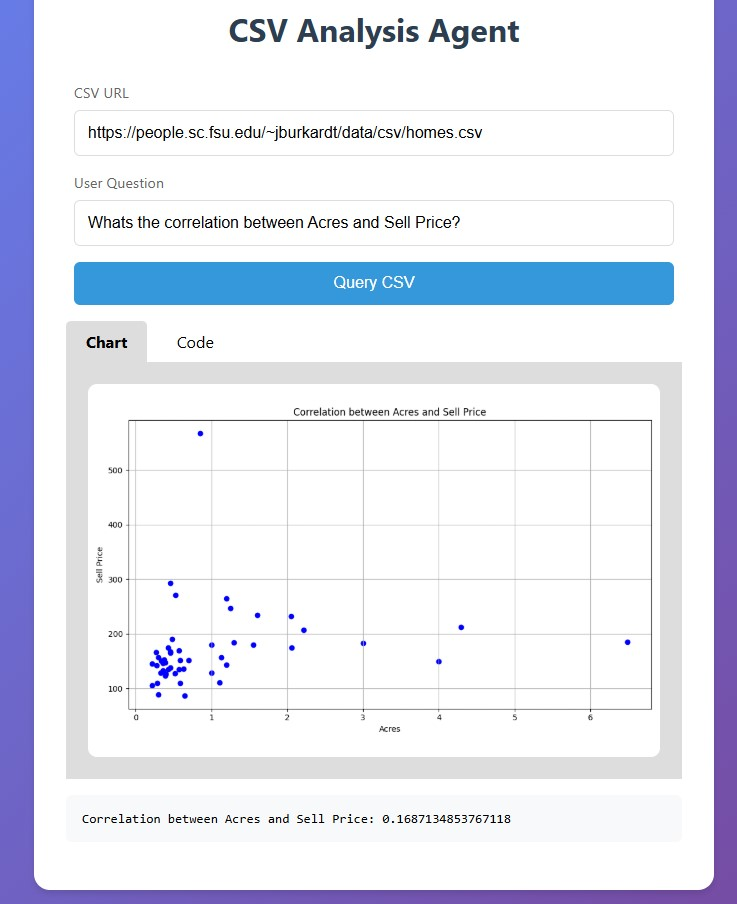
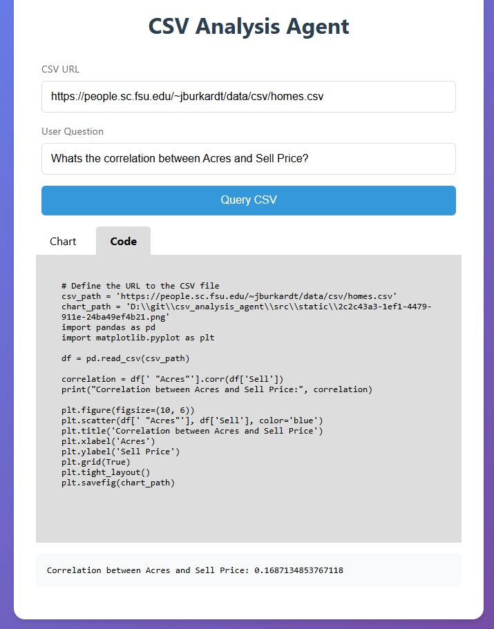
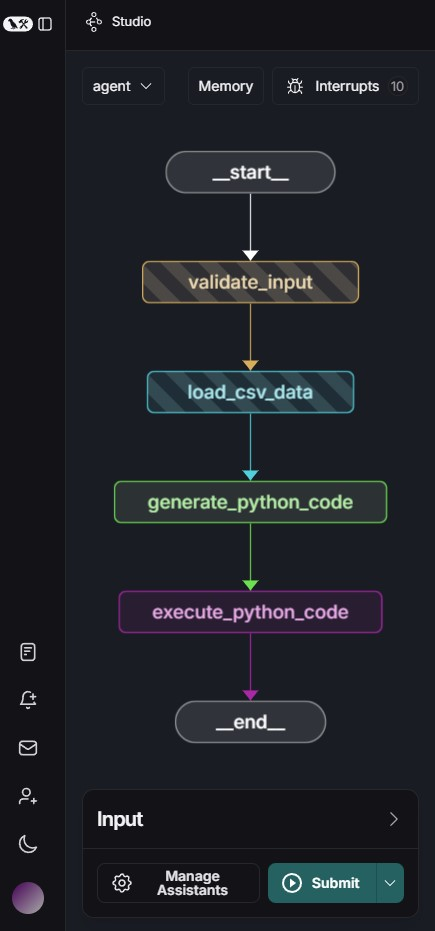

# CSV Analysis Agent

A langgraph Agent hooked up to a Flask web application that allows users to analyze CSV data through natural language queries. The application generates visualizations and provides Python code for the analysis.

## Features

- Natural language query interface
- Automatic data visualization
- Python code generation

## Screenshots

## Installation

# install dependencies
pip install -e ".[dev]"

pip install "langgraph-cli[inmem]" --upgrade

# install lang graph
pip install langgraph-sdk

## Usage
# run lang studio
langgraph dev

# run flask app
python ./src/app.py

1. Enter the URL of your CSV file
2. Ask a question about the data
3. View the generated visualization and Python code

# run graph through command line
python .\src\cli.py -c https://people.sc.fsu.edu/~jburkardt/data/csv/homes.csv -q "whats the average price of houses with 3 bedrooms?"

## Requirements

- Python 3.8+
- Required packages listed in pyproject.toml